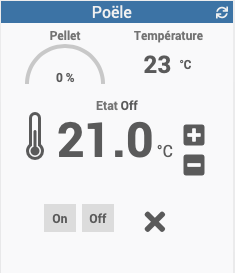

Beschreibung
============

Plugin zur Steuerung eines Heta oder AustroFlamm Pelletofens.

  

Voraussetzungen
=========

Der Pelletofen muss mit einer WiRCU-Box ausgestattet sein:

Sie benötigen die MAC-Adresse und den PIN-Code der Box, die Sie finden können
oben oder in der mobilen Heta-Anwendung registriert:

Installation
=============

Aktivieren Sie das Plugin nach der Installation.

Fügen Sie Geräte hinzu, die darauf achten, die MAC-Adresse und den PIN-Code einzugeben
zuvor erholt.

Betrieb
===============

Das Plugin sammelt jede Minute Informationen vom Herd.

Kompatibilität
==============

Überprüft:
- Heta ScanLine Green 200 [hier](https://heta.dk/en/product/scan-line-green-200/)
- AustroFlamm Poly 2.0 [hier](https://www.austroflamm.com/fr/geraet/polly-2-0/) (Danke an Yann)

Überprüfen
- Alle Geräte, die Box verwenden [Fumis WiRCU](http://www.fumis.si/en/wircu-connection-guide)

RoadMap
========

Geplante Entwicklungen
------------------ ------------------.
- statistische Informationen hinzugefügt
- Kontrolle der Betriebsleistung
- Steuerung der Belüftungsgeschwindigkeit

Geplante Entwicklungen
------------------ ------------------.
- Anzeige des nächsten programmierten Befehls
- verzögerter Startbefehl
- verzögerter Stoppbefehl

Änderungsprotokoll
=========
[Siehe die entsprechende Seite] (changelog.md)