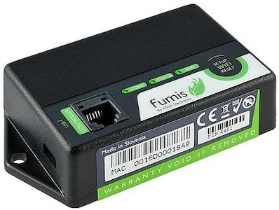
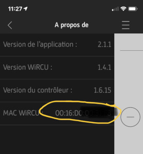

Description
============

Plugin for controlling a Heta or AustroFlamm pellet stove.

  

Prerequisites
=========

The pellet stove must be equipped with a WiRCU box:

You will need the MAC address and the PIN code of the box that you can find
registered above or in the Heta mobile application:

Installation
=============

After installing the plugin, activate it.

Add equipment taking care to enter the MAC address and PIN code
previously recovered.

Operation
===============

The plugin collects information from the stove every minute.

Compatibility
==============

Checked:
- Heta ScanLine Green 200 [here](https://heta.dk/en/product/scan-line-green-200/)
- AustroFlamm Poly 2.0 [here](https://www.austroflamm.com/fr/geraet/polly-2-0/) (Thanks to Yann)

To check
- Any equipment using the box [Fumis WiRCU](http://www.fumis.si/en/wircu-connection-guide)

RoadMap
========

Planned developments
------------------
- added statistical information
- control of operating power
- ventilation speed control

Planned developments
------------------
- display of the next programmed command
- delayed start command
- delayed stop command

Changelog
=========
[See the dedicated page](changelog.md)