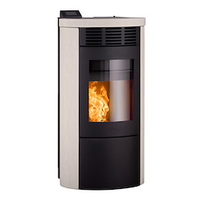
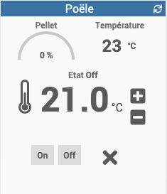
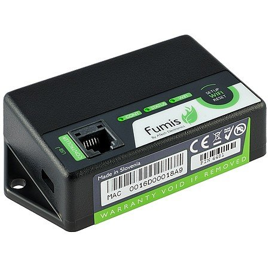
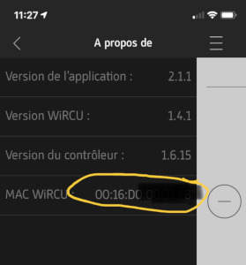

Description 
===========

Plugin servant au controle d'un poële à pellet Heta.

 

Prérequis
=========

Le poële à pellet doit être équipé d'un boitier WiRCU:

Vous aurez besoin de l'adresse MAC du boitier que vous pouvez retrouver
inscrite dessus ou dans l'application mobile Heta:

Installation
============

Après installation du plugin, activez celui-ci.

Ajoutez un équipement en prennant soins de rentrer l'adresse MAC
récupérée précédement.

Fonctionnement
==============

Le plugin récupère les informations du poële toutes les minutes.

Compatibilité
=============

Vérifié:
-   Heta ScanLine Green 200 [ici](https://heta.dk/en/product/scan-line-green-200/)

A vérifier
-   Tout équipement utilisant le boitier [Fumis WiRCU](http://www.fumis.si/en/wircu-connection-guide)

RoadMap
=======

Evolutions prévues
------------------
- ajout des informations statistiques
- controle de la puissance de fonctionnement
- controle de la vitesse de ventilation

Evolutions evisagée
------------------
- affichage de la prochaine commande programmée
- commande de démarrage différée
- commande d'arret différée

Changelog
=========
[Voir la page dédiée](changelog.md)

-----------
> Disclaimer:
>
> Ce plugin est développé à partir d'une analyse des appels fait
> par l'App mobile.
>
> Dans la mesure ou le fabricant changerai le fonctionnement, ce
> plugin pourrait ne plus fonctionner.
>
-----------------
